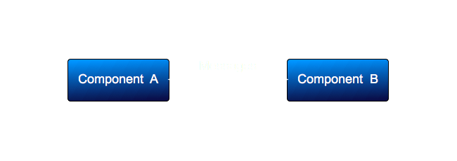
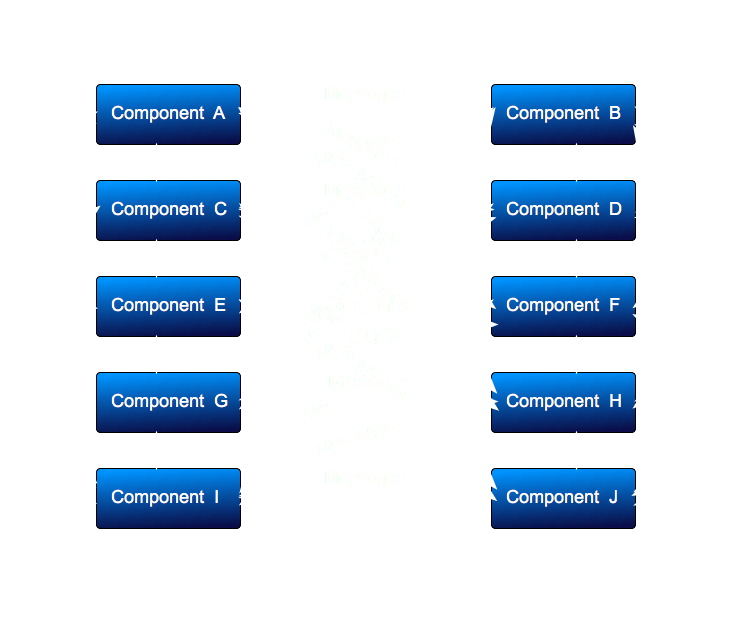

# Redux
by Christian Wilkerson
cpwilkerson72@gmail.com

on Github @ [cpwilkerson.github.io](http://cpwilkerson.github.io)
on Twitter @ cpwilkerson72


This presentation can be found on my github page under **electron-boiler-plate** project.

---

## What are we talking about?

* What is Redux?
* Why use Redux?
* How to use Redux with React

^ Not necessarily in this order

^ We will talk about what Redux is

^ We will talk about why you should or shouldn't use Redux

^ We will talk about how Redux is used with React

---

### Redux

* What is Redux?
  - Redux is a client-side javascript framework
    * Stores application state
    * Provides events

^ Redux is javascript framework that manages two things for you

^ One, it manages your application state by way of the data store

^ Two, it manages events in your application through a uni-directional dataflow.
  
^ More on that later.

---

### Redux

* Quick history lesson
  * Created by Dan Abramov
  * Was trying to understand Flux
  * Happy accident

^ Redux was created by Dan Abramov

^ As I understand it, he was about to do a talk on Flux.  Flux is also a 
  javascript framework that provides state management, and uni-directional event
  flow.

^ Flux was created by Facebook in order to wire up all of the components you see
  on the Facebook web page.

^ Somehow, he wound up simplifying it, and boom!  Redux is born.

---

## Redux

* Why would I use Redux?
  - React components do not know about each other
  - Storing application state in components is bad

^ Why would I use Redux?

^ When I first learned about React, one of the first things I wanted to do was 
connect an edit box to a button, and a label.  

^ I knew just enough jQuery to solve the problem.

^ However, it didn't seem like the React way.

^ Of course I learned Flux, and as soon as I did, Redux came along

---

## Redux

* What came first?  
  - The event or the button?

  

^ When NOT to use Redux

^ For Two components - Redux is overkill

^ This is a situation where setting up all of the boilerplate to run Redux makes
  it a bad choice.  
  
^  Don't use it.

^  Any developer can follow the logic of two controllers.  But how many 
   controllers does it take before things get out of hand?

---

## Redux

* Let's try just 10 components
  

^ At only 10 components, the potential messaging explodes exponentially.

^ There is really no clear indication about where an event starts, or ends.

^ A one person team that will own this app from cradle to grave, is still not a problem. 

^ Onboarding new developers is a clear case of cruel and unusual punishment.

^ Do you store state in one of these components, or all of them, or do they all
  get/set some global variable?

^ What could go wrong?

---

## Redux - Why?

* Redux provides Uni-directional Event Flow
  - Events in Redux all come from a single Provider object
    - Synchronous or Asynchronous
  - Events are initiated by:
    - Form inputs
    - Asynchronous Events

^ Setup properly, all of your events will come from the Redux Provider object

^ Controllers, like buttons, dispatch their event in the form of an Action to the provider.

^ The provider then reduces the action to update state.

^ State is connected to component props, which trigger instant change.

---

## Redux - Why?

* Application state is comes from the Store object
  * When the store updates, the view layer updates
* Works kind of like magic

^ The way that these projects get setup...

^ You don't actually see the code that updates the props/state

^ Just make sure it's all setup right

---

## Redux - How

* How to use Redux
  * This demonstration is for using Redux with React in an electron.js app
  * Electron is a framework that allows you to write desktop apps in javascript
  * If you're using **VS Code**, or **Atom**, or **Slack**, 
    you're already using it.

^ The code that we'll soon be looking at is an electron app

^ Electron apps are desktop apps that are written in the javascript/html/css stack

^ Popular electron based apps are VS Code, Atom, and Slack

^ Good chance you're already using one

^ The electron website has information on distributing your apps

^ They can be closed or open source

---
## Redux

* React component setup
  * React components are created same as non-Redux
  * React components are connected to the Provider and Store

^ React component setup is essentially the same as a non-redux app

^ The only difference is how you export them...we'll look at that soon

--- 

## Redux

* Provider setup

```javascript
<Provider store={store}>
  <AppView />
</Provider>
```

^ We will look at the actual source code in a moment

^ In an Electron app, this is placed in the renderer.js file


---

## Redux

* Store setup

```javascript
const store = createStore(appReducer, applyMiddleware(thunk))

ReactDOM.render(
  <Provider store={store}>
    <AppView />
  </Provider>
  ,(document.getElementById('App'))
)
```

^ The store is created with a call to createStore

---
## Redux

* Store Methods
  * ```dispatch```
  * ```getState()```
  * ```subscribe(listener)```
  * ```replaceReducer(nextReducer)```

^ dispatch is mainly used to trigger state changes by dispatching actions

^ getState will return the current state of the tree

^ subscribe will listen for state changes, then you would call getState

^ replaceReducer is an advanced api that replaces the current reducer.  

^ replaceReducer can be used for dynamically loading reducers.

^ My example will only be demonstrating dispatch

---
## Redux

* mapStateToProps

```javascript
function mapStateToProps(state, props) {
  return {
    userName: state.userName,
    weather: state.weather,
    gettingWeather: state.gettingWeather,
    error: state.error
  }
}
```

^ mapStateToProps - this method magically connects your component props to the store

^ When the store changes, your component will instantly update

---
## Redux

* mapDispatchToProps

```javascript
function mapDispatchToProps(dispatch) {
  return {
    getWeather: (location) => dispatch(getCurrentWeather(dispatch, location))
  }
}
```

^ Methods in your component that need to map to hook up to the dispatch

^ are connected via mapDispatchToProps

---
### Redux

* ```connect``` by default

```javascript
export default connect(mapStateToProps, mapDispatchToProps)(Weather)
export {Weather}
```

^ Export the default version of your component using connect

^ Or the standalone version 

---

## Code Time!

Time to look at some code!

---

## Q&A

Before I finish, are there questions?

^ Something you want to see again?

---

## Wrapping Up

* We learned what Redux is
* We learned why Redux is used
* We learned how to use Redux with React with Electron

---

## Wrapping Up

* Where to go from here?
  * Modify this boiler plate app into a yeoman generator
  * Provide better css
    - Good looking apps are more performant

---
## Thank You

### cpwilkerson.github.io


